# RTL Design and Synthesis Using SKY130
This repository documents the work done during the course of the "RTL Design and Synthesis workshop Using sky130" conducted from 11/06/25 to 20/06/25.

## Day 1 - Introduction to Verilog RTL design and Synthesis
The agenda for the first day was to get familiar with the tool flow using iverilog and also with using yosys for synthesizing the design. 
The figure below shows the structure of a tesst bench that is used to provide a stimulus to verify the design functionality: 
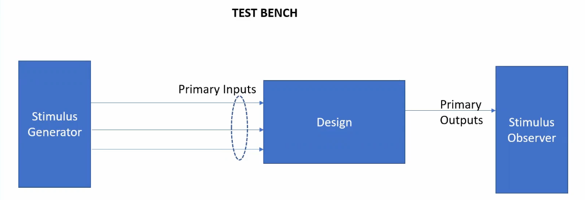

Once we have the design and the testbench reaady we are ready to use iverilog to versify if the design works as intended. To do so, we use the flow as depicted below: 
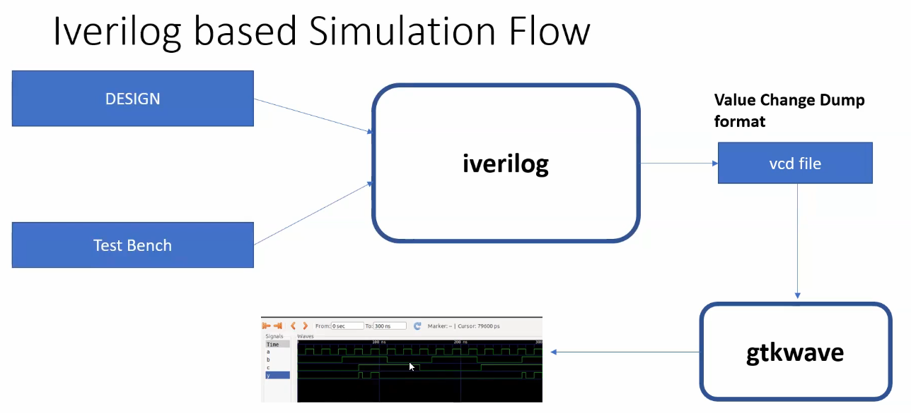  

When simulating the behaviour of the design using iverilog the following steps need to be followed:
- To launch the iverilog tool you need to provide the design and testbench files as arguments  
`iverilog <design.v> <tb_design.v>`
- Following this, a a.out file will be created that you can execute by  
`./a.out`
- This open the .vcd file, using which you can observe the signal waveforms using gtkwave  
`gtkwave <vcd-file-name>`  

The result of the iverilog-based simulation flow for the design good_mux.v using the tb_good_mux.v as the testbench is as follows:
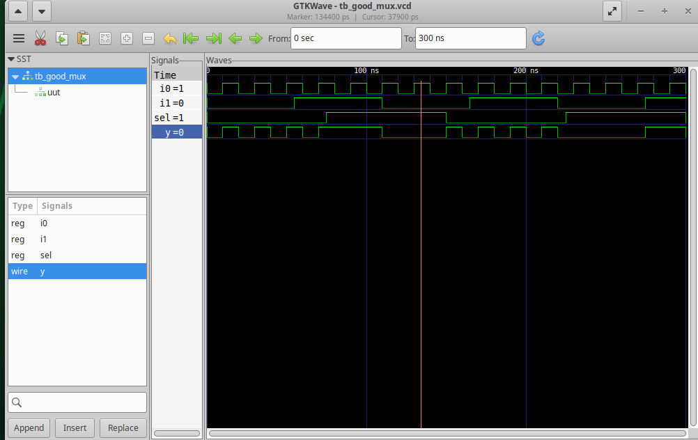  

After verifying the design,  it's time to use the yosys tool to synthesize the design. The figure below explains the flow using yosys tool:  
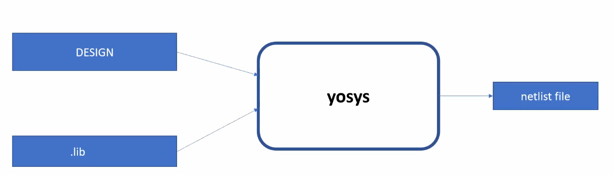

The following steps explain the process of using yosys for synthesis:
- Launch the yosys tool  
`yosys`
- Once yosys is launched, read the .lib files using  
`read_liberty -lib <path-to-lib-file>`
- Next, read the verilog design file(s) using  
`read_verilog <.v file>`
- Following this, we synthesize the top module of the design  
`synth -top <module-name>`
- Once this completes, we run the following command so that the netlist is created  
`abc -liberty <path-to-lib-file>`
- To write the netlist we run the following command  
`write_verilog <name.v>`  
Note: The name can be anything the user chooses.  
For generating a simplified version of the netlist we can also run  
`write_verilog -noattr <name.v>`
- To see the synthesized design in a graphical form run  
`show`  

Once synthesis completes, we need to verify that the synthesized design (i.e. the netlist generated) works as intended, as verified when using the iverilog tool. The flow for doing so is as shown in the figure below:  
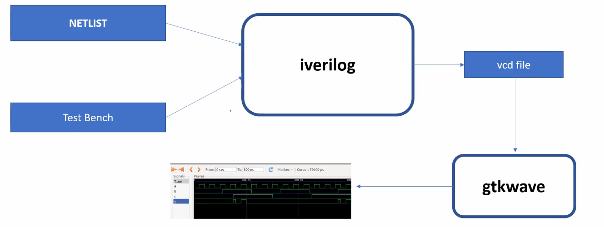   

The entire synthesis flow can be summarized as follows:  
   

For Day1, we exercised all the steps described above for the good_mux.v design. The synthesis setps are executed are:  
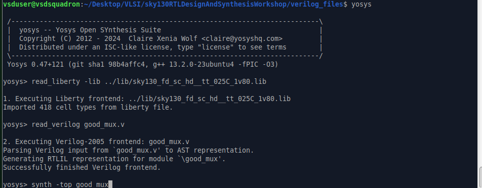   

The state of the signals after creating the netlist is: 
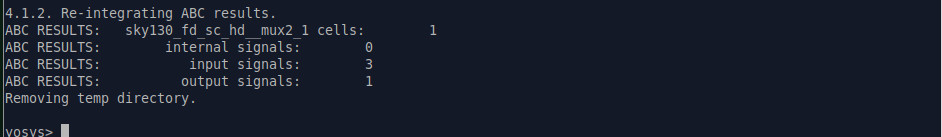   

The synthesized design for good_mux.v is as follows:  
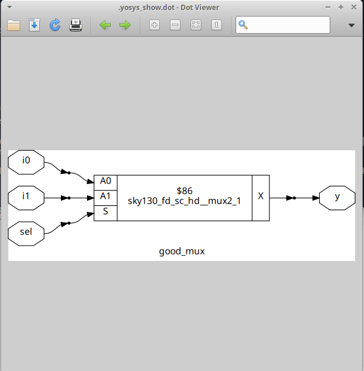   

Finally, the netlist generated for good_mux.v is as shown below:  
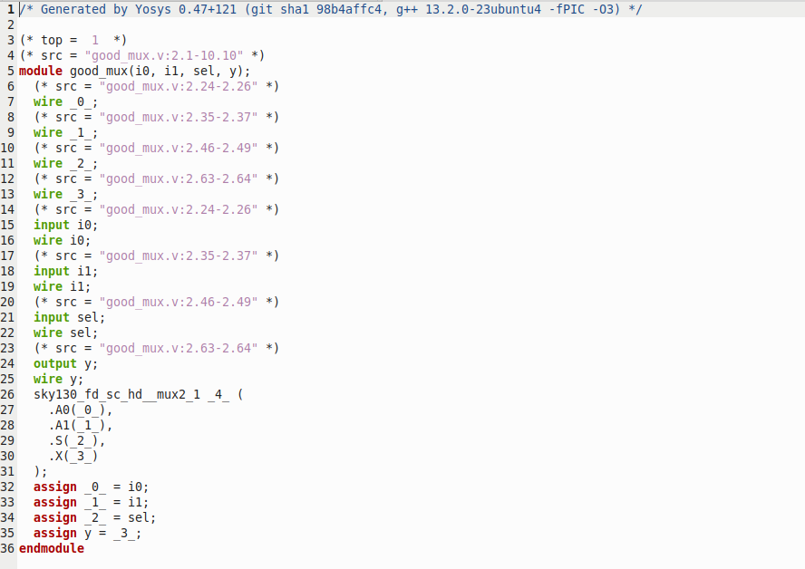   

The simplified version of this netlist is:  
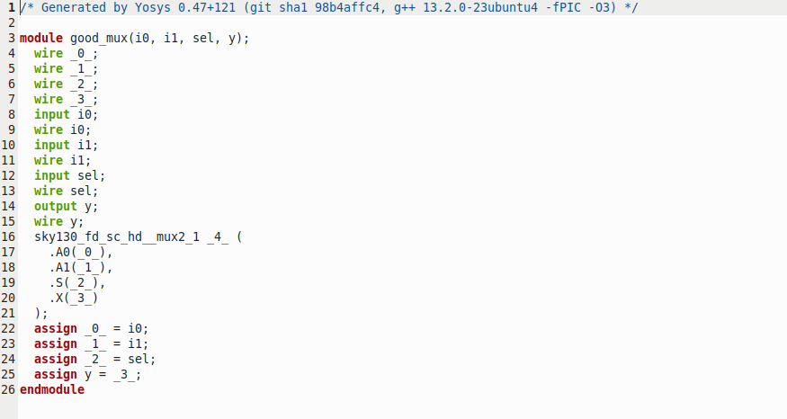   

## Day 2 - Timing libs, hierarchical vs flat synthesis and efficient flop coding styles
On the second day of the workshop, the various types of standard cells such as fast, slow and typical were discussed. These cells ensure that Process-Voltage-Temperature (PVT) variations do not have a serious impact on the working of the chip.  

In addition, the difference between hierarchical and flat synthesis was also introduced. When trying to synthesize the design described in multiple_modules.v we see an error as shown below:  
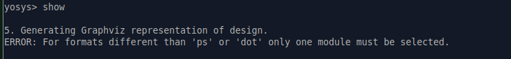   

This can be resolved by running the command  
`show multiple_modules`  
instead of the `show` command we usually run since this represents the hierarchical design. The result of using this is:  
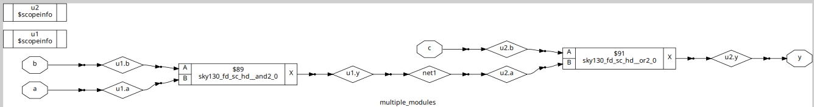   

The concept of module-level synthesis was also introduced and is preferred when we have multiple instances of the same module. The result of performing the module-level synthesis for sub-module1 in multiple_modules.v is:  
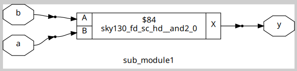   

When trying to write the netlist of a design containing hierarchies we use:  
`flatten`  
before executing the `write_verilog ..` command to flatten out the hierarchies.  

If there any D flip-flops present in the design we need to run  
`dfflibmap -liberty  <path-to-lib-file>`  
after the `synth -top ...` command since in certain cases the flop libraries and standard cell libraries are kept separate.

We also saw variations of the D flip-flop which are described below along with their simulation and synthesis results:
- Asynchronous reset D flip-flop (dff_asyncres.v): The reset signal of the flip-flop is independent of the clock  
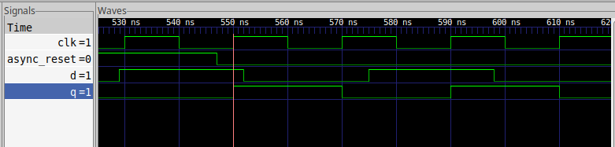   
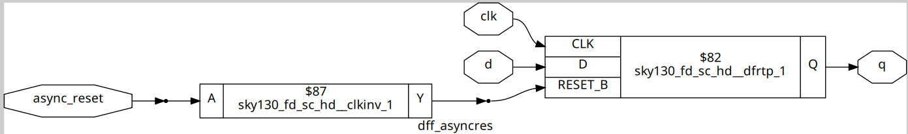   

- Asynchronous set D flip-flop (dff_async_set.v): The set signal of the flip-flop is independent of the clock  
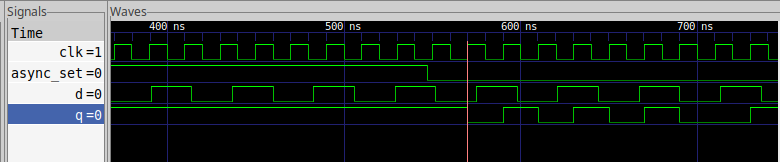   

- Synchronous reset D flip-flop (dff_syncres.v): The reset signal of the flip-flop is dependent on the positive edge of the clock  
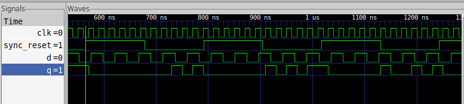   
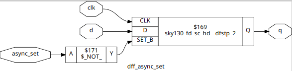   

- Asynchronous + Synchronous reset D flip-flop (dff_asyncres_synncres.v): There are two reset signals for the flip-flop, one which depends on the positive edge of the clock and the other which is independent of the clock  
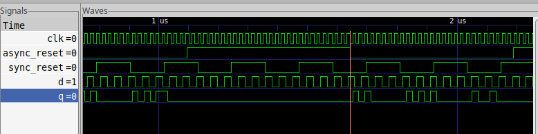   
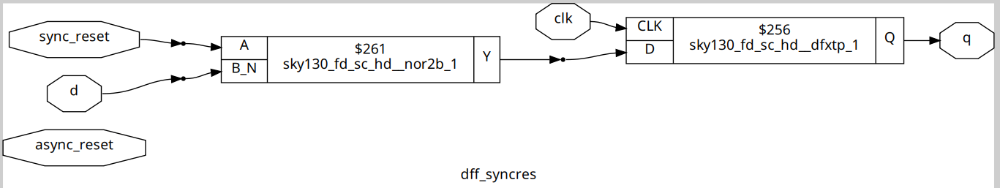   

Finally, we also explored some synthesis optimizations for the designs described in mult_2.v and mult_8.v.

- For mult_2.v
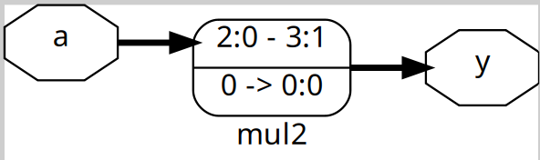   

- For mult_8.v
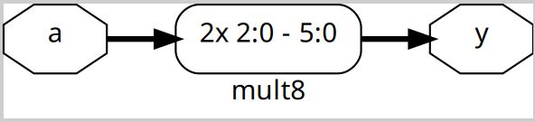   

## Day 3 - Combinational and sequential optmizations
On Day3, the various types of optimization strategies for both combination and sequential circuits were introduced. When, performing the constant propagation optimization we need to run  
`opt_clean -purge`  
after running the `synth -top ...` command.  

The following combinational circuit designs were considered when trying to perform the optimization during synthesis:
- opt_check.v  
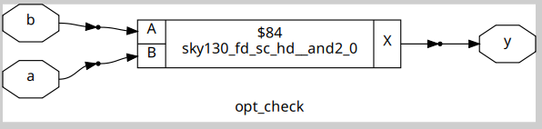   

- opt_check2.v  
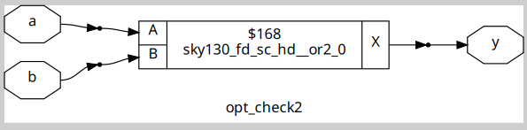   

- opt_check3.v  
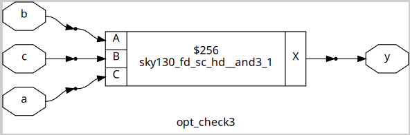   

- opt_check4.v  
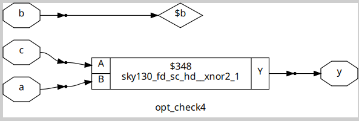   

- multiple_module_opt.v  
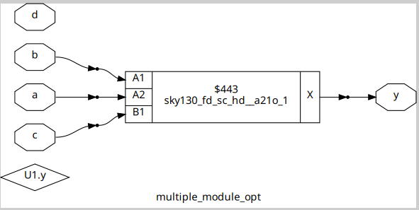   
Note: In this case we needed to first flatten the hierarchies before performing the optimization purge.  

In addition to the combinational designs mentioned above, several sequential circuit designs were also considered when trying to perform the optimization during synthesis:
- dff_const1.v  
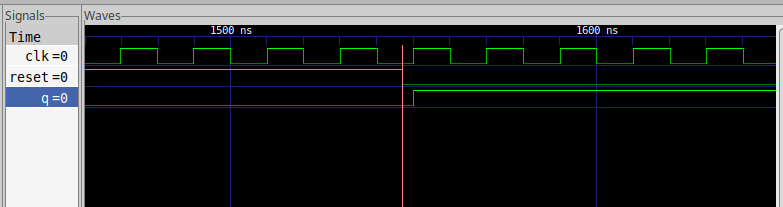   
   

- dff_const2.v  
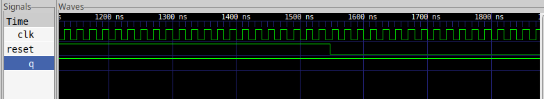   
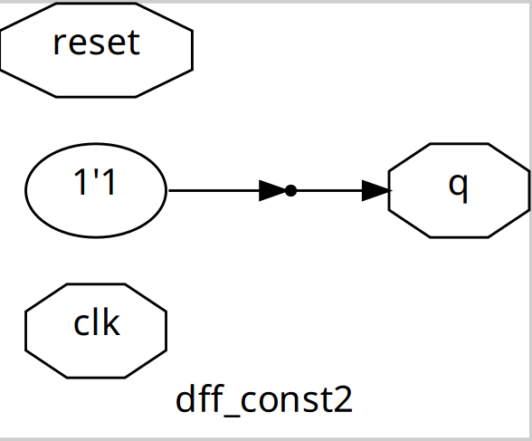   

- dff_const3.v  
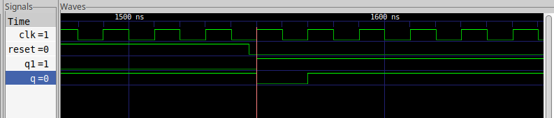   
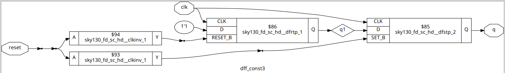   

- dff_const4.v  
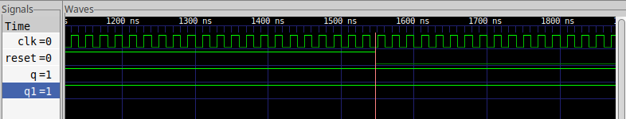   
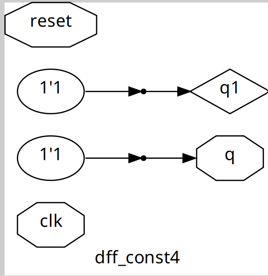   

- dff_const5.v  
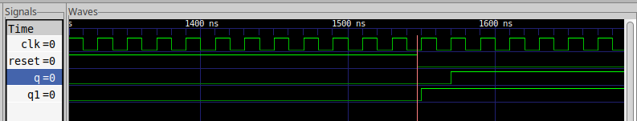   
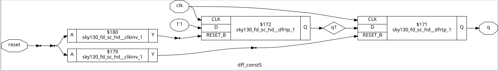   

Lastly, two separate counter designs were also optimized during synthesis. There are:
- counter_opt.v: Only one bit of the counter is connected to the final output hence the unused bits are optimized.  
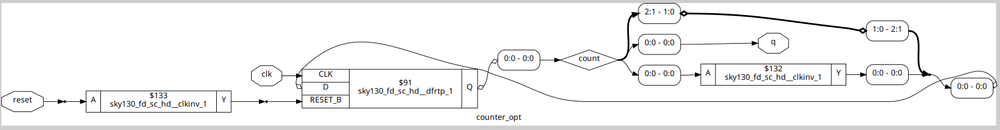   

- counter_opt2.v: All bits of the counter are connected to the final output in this case.  
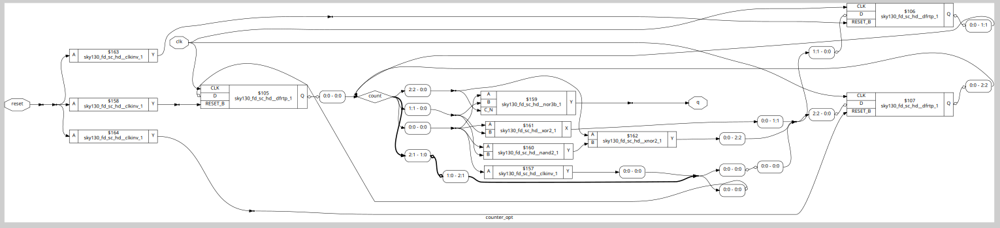   

## Day 4 - GLS, blocking vs non-blocking and Synthesis-Simulation mismatch
The topic of discussion for Day4 for that of gate-level simulation (GLS) wherein, we verify if the netlist synthesized using yosys behaves as per the original design. The netlist is stimulated using the same testbench as previously described in Day1.  

The GLS flow is as shown below:
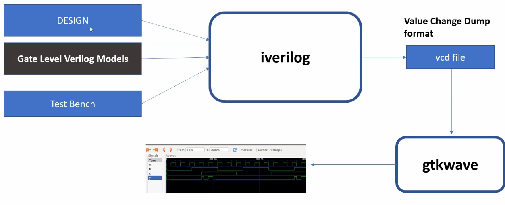   

When performing the GLS using iverilog, we use the following command  
`iverilog <path to verilog file containing primitives> <path to verilog file for the cells in .lib file> <design.v> <tb_design.v>`  
the steps following this remain unchanged.  

For the design ternary_mux.v we first verify the design using iverilog and then perform the synthesis. The results are as shown:
   
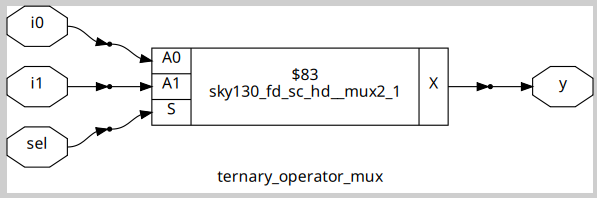   
Following synthesis, we perform the GLS for ternary_mux and the result is:
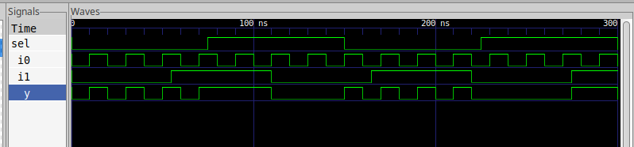   

We also saw that there can be synthesis simulation mismathces which can cause the synthesized design to behave differently than expected. To drive this point we take the following two designs:  
- bad_mux.v: The missing sensitivity list results in the synthesis-simulation mismatch.  
Results of the verilog design:  
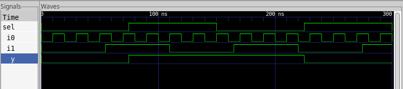   
Results of the synthesized netlist:  
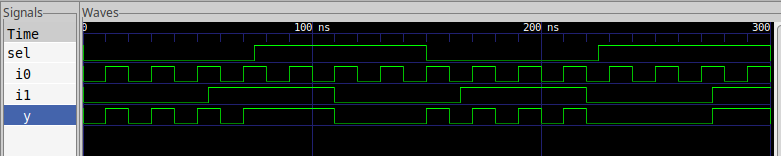   

- blocking_caveat.v: The blocking assignment statements cause the synthesis simulation mismatch. 
Results of the verilog design:  
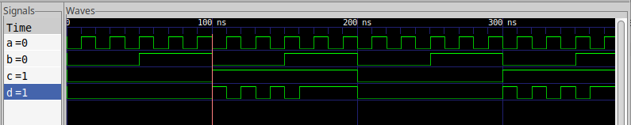   
Results of the synthesized netlist:  
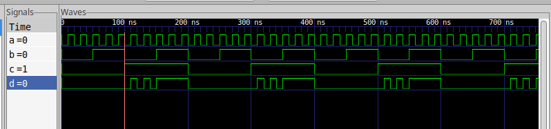   