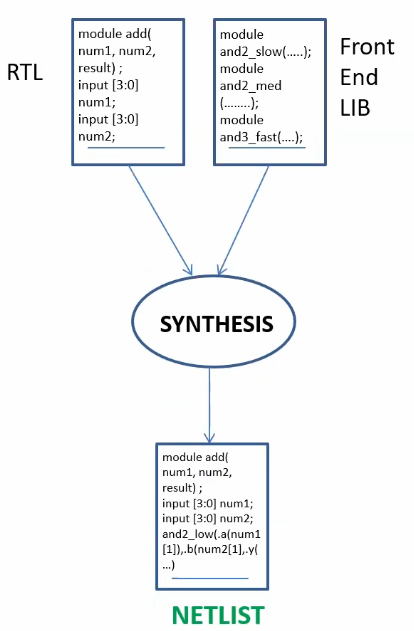

# RTL Design and Synthesis Using SKY130
This repository documents the work done during the course of the "RTL Design and Synthesis workshop Using sky130" conducted from 11/06/25 to 20/06/25.

## Day 1 - Introduction to Verilog RTL design and Synthesis
The agenda for the first day was to get familiar with the tool flow using iverilog and also with using yosys for synthesizing the design. 
The figure below shows the structure of a tesst bench that is used to provide a stimulus to verify the design functionality: 

Once we have the design and the testbench reaady we are ready to use iverilog to versify if the design works as intended. To do so, we use the flow as depicted below: 
  

When simulating the behaviour of the design using iverilog the following steps need to be followed:
- To launch the iverilog tool you need to provide the design and testbench files as arguments  
`iverilog <design.v> <tb_design.v>`
- Following this, a a.out file will be created that you can execute by  
`./a.out`
- This open the .vcd file, using which you can observe the signal waveforms using gtkwave  
`gtkwave <vcd-file-name>`  

The result of the iverilog-based simulation flow for the design good_mux.v using the tb_good_mux.v as the testbench is as follows:
  

After verifying the design,  it's time to use the yosys tool to synthesize the design. The figure below explains the flow using yosys tool:  

The following steps explain the process of using yosys for synthesis:
- Launch the yosys tool  
`yosys`
- Once yosys is launched, read the .lib files using  
`read_liberty -lib <path-to-lib-file>`
- Next, read the verilog design file(s) using  
`read_verilog <.v file>`
- Following this, we synthesize the top module of the design  
`synth -top <module-name>`
- Once this completes, we run the following command so that the netlist is created  
`abc -liberty <path-to-lib-file>`
- To write the netlist we run the following command  
`write_verilog <name.v>`  
Note: The name can be anything the user chooses.  
For generating a simplified version of the netlist we can also run  
`write_verilog -noattr <name.v>`
- To see the synthesized design in a graphical form run  
`show`  

Once synthesis completes, we need to verify that the synthesized design (i.e. the netlist generated) works as intended, as verified when using the iverilog tool. The flow for doing so is as shown in the figure below:  
   

The entire synthesis flow can be summarized as follows:  
   

For Day1, we exercised all the steps described above for the good_mux.v design. The synthesis setps are executed are:  
   

The state of the signals after creating the netlist is: 
   

The synthesized design for good_mux.v is as follows:  
   

Finally, the netlist generated for good_mux.v is as shown below:  
   

The simplified version of this netlist is:  
   

## Day 2 - Timing libs, hierarchical vs flat synthesis and efficient flop coding styles

## Day 3 - Combinational and sequential optmizations

## Day 4 - GLS, blocking vs non-blocking and Synthesis-Simulation mismatch